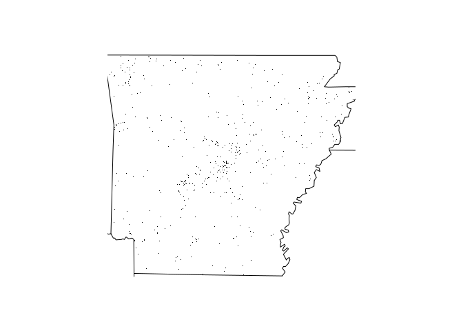

<!-- README.md is generated from README.Rmd. Please edit that file -->

# franklinsFARSPkgJHMSDR

<!-- badges: start -->

[](https://travis-ci.org/FranklinBetten/franklinsFARSPkgJHMSDR)
<!-- badges: end -->

The goal of franklinsFARSPkgJHMSDR is to provide a package which enables
users to utilize the FARS processing functions we worked with in week 2
of this course. These functions facilitaty users to easily load data,
summarize accident data across mutliple years, and visualize data on a
state by state bases. The secondary goal of this package is to help
Franklin get a specialization in R software development.

## Installation

You can install the released version of franklinsFARSPkgJHMSDR from
[CRAN](https://CRAN.R-project.org) with: I NEED TO SET THIS TO GITHUB
ONCE I HAVE MADE A REPO FOR THIS RPROJ

``` r
# since package not accpeted to cran I think I should rmv this part
install.packages("franklinsFARSPkgJHMSDR")
#> Installing package into '/home/feb23/R/x86_64-pc-linux-gnu-library/3.6'
#> (as 'lib' is unspecified)
#> Warning: package 'franklinsFARSPkgJHMSDR' is not available (for R version
#> 3.6.1)
# and replace with github install method
#install_github("franklinsFARSPkgJHSDR") # or is it a git address?
```

## Example

This is a basic example which shows you how to solve a common problem:

``` r
library(franklinsFARSPkgJHMSDR)
print(getwd())
#> [1] "/home/feb23/Desktop/JohnsHopkinsRSoftDev/buildRPackages/buildPackageYoutube/franklinsFARSPkgJHMSDR"
#setwd(paste(path.package(package = "franklinsFARSPkgJHMSDR"),"/data"))
# generate the name of a data file. It actually might be easier to not @export this function
# since the users shouldnt have to use it and it is a helper function to other functions in the 
#fars_functions.R tool set. 
print(make_filename("2013"))
#> [1] "accident_2013.csv.bz2"
#if the file does not exist / the pkg cannot find it the make_filename fxn will throw an error
make_filename("2016")
#> [1] "accident_2016.csv.bz2"
```

The next step after genearting a file name and checking that it exists,
would be to read some FARS
data:

``` r
#this is how to read in a data set that the user may want to do some analysis on or manipulate in some way. 
farsDataTibble <- fars_read("accident_2013.csv.bz2")
# or using the make_Filename functon will do the same thing with less user input
farsDataTibble <- fars_read(make_filename("2013"))
print(farsDataTibble)
#> # A tibble: 30,202 x 50
#>    STATE ST_CASE VE_TOTAL VE_FORMS PVH_INVL  PEDS PERNOTMVIT PERMVIT
#>    <dbl>   <dbl>    <dbl>    <dbl>    <dbl> <dbl>      <dbl>   <dbl>
#>  1     1   10001        1        1        0     0          0       8
#>  2     1   10002        2        2        0     0          0       2
#>  3     1   10003        1        1        0     0          0       1
#>  4     1   10004        1        1        0     0          0       3
#>  5     1   10005        2        2        0     0          0       3
#>  6     1   10006        2        2        0     0          0       3
#>  7     1   10007        1        1        0     0          0       1
#>  8     1   10008        2        2        0     0          0       2
#>  9     1   10009        1        1        0     0          0       1
#> 10     1   10010        2        2        0     0          0       4
#> # … with 30,192 more rows, and 42 more variables: PERSONS <dbl>,
#> #   COUNTY <dbl>, CITY <dbl>, DAY <dbl>, MONTH <dbl>, YEAR <dbl>,
#> #   DAY_WEEK <dbl>, HOUR <dbl>, MINUTE <dbl>, NHS <dbl>, ROAD_FNC <dbl>,
#> #   ROUTE <dbl>, TWAY_ID <chr>, TWAY_ID2 <chr>, MILEPT <dbl>,
#> #   LATITUDE <dbl>, LONGITUD <dbl>, SP_JUR <dbl>, HARM_EV <dbl>,
#> #   MAN_COLL <dbl>, RELJCT1 <dbl>, RELJCT2 <dbl>, TYP_INT <dbl>,
#> #   WRK_ZONE <dbl>, REL_ROAD <dbl>, LGT_COND <dbl>, WEATHER1 <dbl>,
#> #   WEATHER2 <dbl>, WEATHER <dbl>, SCH_BUS <dbl>, RAIL <chr>,
#> #   NOT_HOUR <dbl>, NOT_MIN <dbl>, ARR_HOUR <dbl>, ARR_MIN <dbl>,
#> #   HOSP_HR <dbl>, HOSP_MN <dbl>, CF1 <dbl>, CF2 <dbl>, CF3 <dbl>,
#> #   FATALS <dbl>, DRUNK_DR <dbl>

#aggregating several years worth of FARS data into one data set 
fars2013to2015 <- fars_read_years(c(2013:2015))
print(fars2013to2015)
#> [[1]]
#> # A tibble: 30,202 x 2
#>    MONTH  year
#>    <dbl> <int>
#>  1     1  2013
#>  2     1  2013
#>  3     1  2013
#>  4     1  2013
#>  5     1  2013
#>  6     1  2013
#>  7     1  2013
#>  8     1  2013
#>  9     1  2013
#> 10     1  2013
#> # … with 30,192 more rows
#> 
#> [[2]]
#> # A tibble: 30,056 x 2
#>    MONTH  year
#>    <dbl> <int>
#>  1     1  2014
#>  2     1  2014
#>  3     1  2014
#>  4     1  2014
#>  5     1  2014
#>  6     1  2014
#>  7     1  2014
#>  8     1  2014
#>  9     1  2014
#> 10     1  2014
#> # … with 30,046 more rows
#> 
#> [[3]]
#> # A tibble: 32,166 x 2
#>    MONTH  year
#>    <dbl> <int>
#>  1     1  2015
#>  2     1  2015
#>  3     1  2015
#>  4     1  2015
#>  5     1  2015
#>  6     1  2015
#>  7     1  2015
#>  8     1  2015
#>  9     1  2015
#> 10     1  2015
#> # … with 32,156 more rows
```

There are several years worth of FARS data stored with this package. Its
difficult to simply look at several years worth of FARS data in Tibble
format and grasp trends that may be present. The
`franklinsFARSPkgJHMSDR` package has tools to help the users summarize
FARS data across multiple years on a per month basis:

``` r

smry2013to2015 <- fars_summarize_years(c(2013:2015))
print(fars2013to2015)
#> [[1]]
#> # A tibble: 30,202 x 2
#>    MONTH  year
#>    <dbl> <int>
#>  1     1  2013
#>  2     1  2013
#>  3     1  2013
#>  4     1  2013
#>  5     1  2013
#>  6     1  2013
#>  7     1  2013
#>  8     1  2013
#>  9     1  2013
#> 10     1  2013
#> # … with 30,192 more rows
#> 
#> [[2]]
#> # A tibble: 30,056 x 2
#>    MONTH  year
#>    <dbl> <int>
#>  1     1  2014
#>  2     1  2014
#>  3     1  2014
#>  4     1  2014
#>  5     1  2014
#>  6     1  2014
#>  7     1  2014
#>  8     1  2014
#>  9     1  2014
#> 10     1  2014
#> # … with 30,046 more rows
#> 
#> [[3]]
#> # A tibble: 32,166 x 2
#>    MONTH  year
#>    <dbl> <int>
#>  1     1  2015
#>  2     1  2015
#>  3     1  2015
#>  4     1  2015
#>  5     1  2015
#>  6     1  2015
#>  7     1  2015
#>  8     1  2015
#>  9     1  2015
#> 10     1  2015
#> # … with 32,156 more rows
```

Once you have collected FARS data of interest to you, you may be
interested in where the most accidents occur. The fars\_map\_state plots
all of the accidents for a whole year on the map of the state that they
happened in. The state is selected numerically (1-50), and the year is
selected as an integer 2013, 2014, or 2015.

You can also embed plots, for example:



In that case, don’t forget to commit and push the resulting figure
files, so they display on GitHub\!
